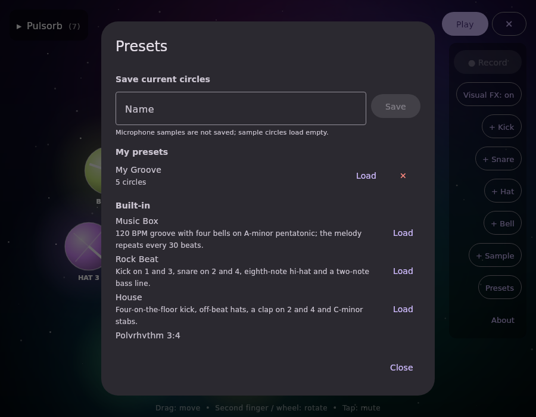

# Pulsorb

A playful drum machine built with **Kotlin Multiplatform** and **Compose Multiplatform**.
Every glowing circle on the screen is an independent drum. Move a circle to change its tempo
and volume, twist it to change its pitch, and add echo or reverb. Everything is synthesized in
real time, and you can record the result to a WAV file.

Runs on **Android** and **Desktop** (Linux, macOS, Windows).


## Download

Get the latest version from the [Releases](https://github.com/MarekDudka/Pulsorb/releases) page:

- **Android** (7.0 or newer): download `Pulsorb-<version>.apk` and open it on your phone. Android will ask
  you to allow installing apps from your browser or file manager.
- **Linux** (x86-64): download `Pulsorb-<version>-x86_64.AppImage`, make it executable and run it:
  ```bash
  chmod +x Pulsorb-*-x86_64.AppImage
  ./Pulsorb-*-x86_64.AppImage
  ```
  It includes its own Java runtime, so nothing else needs to be installed.
- **Windows** (64-bit): download `Pulsorb-<version>-windows-x64.msi` (installer) or
  `…-windows-x64-setup.exe`, or `…-windows-x64-portable.zip` to run `Pulsorb.exe` without installing.
  The app isn't code-signed, so Windows may show "Windows protected your PC": click **More info →
  Run anyway**.
- **macOS** 11 or newer: download `Pulsorb-<version>-macos-arm64.dmg` for Apple silicon (M1 and
  newer) or `…-macos-x64.dmg` for Intel Macs (Apple menu → About This Mac shows which you have),
  then drag Pulsorb to Applications. The app isn't notarized by Apple, so the first launch is
  blocked once:
  1. Open Pulsorb. macOS says it can't verify the app; click **Done**.
  2. Open **System Settings → Privacy & Security**, scroll down and click **Open Anyway** next to
     the Pulsorb message, then confirm with your password.

  After that it opens normally. (On macOS 14 and older you can instead right-click Pulsorb → **Open**.)

All desktop versions include their own Java runtime. `SHA256SUMS*` files let you check the
downloads with `sha256sum -c`.

## Features

- **Kick, snare, hi-hat, bell and sample circles**: each one has its own beat clock, tempo, volume and pitch
- **A melody ready to play**: press Play and a 120 BPM groove starts with four bells on A-minor pentatonic
  notes. The bells loop at different speeds, so the melody keeps changing and only repeats every 30 beats
- **Microphone samples**: record a short sound and play it as a drum hit
- **Presets**: six built-in grooves, and save or load your own (see below)
- **Echo** (tempo-synced) and **reverb** for every circle
- **Multi-touch**: drag several circles at once, twist with two fingers to rotate
- **Record the output** to a WAV file
- Add and remove circles while the music is playing (up to 12)
- Animated glowing background and particle bursts on every beat, kept gentle on purpose and
  fully switchable off (**Visual FX: off**) for photosensitive users
- Collapsible circle list

## Controls

The screen is a 2D coordinate plane with its origin **(0, 0) in the bottom-left corner**.

| Gesture | Effect |
|---|---|
| Move a circle **up** | Faster tempo: 40 → 240 BPM |
| Move a circle **right** | Louder: 0 → 100 % |
| **Rotate** a circle (second finger, or mouse wheel on desktop) | Higher pitch, 60 Hz → 18 kHz on a log scale (~2 octaves per turn) |
| **Tap** a circle | Mute / unmute |
| **Echo / Reverb** sliders in the list | Effect amount for that circle |
| **● / ■** in the list (sample circles) | Record / stop the microphone sample |
| **✕** in the list | Remove the circle |
| Tap the **▾ Pulsorb** header | Show / hide the circle list |
| **Presets** | Load a built-in preset, or save, load and delete your own |
| **About** | App version, author, license, privacy and credits |

**Play/Stop** and the **☰** menu button are always visible in the top-right corner. The menu holds
**● Record** (records the mixed output), **Visual FX**, **+ Kick / + Snare / + Hat / + Sample** to
add circles, and **About**. Tap **☰ / ✕** to show or hide it. It scrolls on small screens, so every
button stays reachable. While the menu is hidden, a red recording timer appears next to **Stop**
during recording. The app starts stopped; press **Play**.

For a sample circle, 440 Hz plays the recording at its original speed. Lower values slow it down
and higher values speed it up.

On Android, playback pauses automatically when the app goes to the background (a recording in
progress is saved first); press **Play** to continue. On desktop it keeps playing when minimized.

Both panels start folded: tap **▸ Pulsorb** to show the circle list and **☰** to show the menu.

| | |
|---|---|
|  |  |
| The start-up melody with the circle list and menu open | Six circles with echo and reverb, recording in progress |

## Presets

Open **☰ → Presets** to load one of the built-in presets or save the current circles under a name.
A preset stores each circle's instrument, tempo, volume, pitch, echo, reverb and mute state, plus its
timing relative to the other circles, so a saved groove comes back exactly in time. Microphone
samples are never written to storage, so Sample circles load empty; press ● to record them again.

| Built-in preset | What it is |
|---|---|
| Music Box | 120 BPM groove with four bells on A-minor pentatonic; the melody repeats every 30 beats (loads on start) |
| Rock Beat | Kick on 1 and 3, snare on 2 and 4, eighth-note hi-hat and a two-note bass line |
| House | Four-on-the-floor kick, off-beat hats, a clap on 2 and 4 and C-minor stabs |
| Polyrhythm 3:4 | Two bells in a 3-against-4 cross-rhythm over a steady pulse |
| Ambient Drift | Slow D-major pentatonic bells at unrelated tempos with long reverb |
| Tom Circle | Kicks tuned as toms in an interlocking pattern with a shaker-like hi-hat |

All built-in presets are original. They use common genre rhythms and scales, which anyone may use,
and contain no existing songs or melodies.

Saved presets are small JSON files:

- **Android:** the app's private storage (removed when the app is uninstalled)
- **Linux:** `~/.local/share/Pulsorb/presets/` (or `$XDG_DATA_HOME/Pulsorb/presets/`)
- **Windows:** `%APPDATA%\Pulsorb\presets\`; **macOS:** `~/Library/Application Support/Pulsorb/presets/`

You can share preset files by copying them into that folder. Files are treated as untrusted: values
are clamped to valid ranges, unknown instruments are skipped, and files over 64 KB are ignored.



## Recordings

Press **● Record** while playing and press it again (or **Stop**) to save. Recordings are
44.1 kHz mono 16-bit WAV files named `Pulsorb-yyyyMMdd-HHmmss.wav`:

- **Desktop:** `~/Music/Pulsorb/`
- **Android 10+:** shared `Music/Pulsorb` folder (no storage permission needed)
- **Android 7–9:** the app's own music folder (the path is shown after saving)

Recording stops automatically after 5 minutes. Recordings made in the same second never overwrite each other.

## Building and running

Requirements: JDK 17 or newer (21 recommended), plus the Android SDK for the Android build.

```bash
# Desktop
./gradlew :composeApp:run

# Android (device or emulator connected)
./gradlew :composeApp:installDebug

# Tests (desktop + Android unit tests)
./gradlew :composeApp:desktopTest :composeApp:testDebugUnitTest
```

### Tests

Shared tests in `composeApp/src/commonTest` run on both desktop and Android:

- **VoiceTest**: tempo, mute, volume, pitch, sample speed, echo timing, reverb tail, removal fade-out,
  and stability (no NaN or overflow) at extreme settings for every drum
- **CircleStateTest**: screen position and rotation mapped to tempo, volume and 60 Hz – 18 kHz pitch
- **SamplePrepTest**: microphone sample trimming, normalization, fade-out, silence rejection
- **WavTest**: WAV header and sample encoding
- **SoundEngineTest** and **ParticleSystemTest**: voice management, soft clipping, particle limits
- **PresetsTest**: built-in presets are valid and don't overlap on screen, JSON round trip, clamping
  of untrusted files, safe file names, and saved timing restoring the exact same groove

Desktop-only tests in `composeApp/src/desktopTest` play about 2 seconds of sound on the real audio
device, decode a recording with Java's own WAV reader, and check that saved files never overwrite
each other. `PresetFilesTest` checks saving, replacing, deleting and path-traversal protection in a
temporary folder. `SceneRenderTest` renders 30 seconds of every built-in preset offline, checks none
is clipped or too quiet, and leaves them in `composeApp/build/demo/` so you can listen to them.

You can also open the project in Android Studio or IntelliJ IDEA.

### Release builds

```bash
# Signed, shrunk Android APK -> composeApp/build/outputs/apk/release/
./gradlew :composeApp:assembleRelease

# Linux AppImage -> dist/Pulsorb-<version>-x86_64.AppImage (needs mksquashfs)
./scripts/build-appimage.sh
```

Windows (`.msi`, setup `.exe`, portable `.zip`) and macOS (`.dmg`) packages can only be built on
those systems, so [GitHub Actions](.github/workflows/desktop-builds.yml) builds them on GitHub's
free Windows, Apple-silicon and Intel Mac machines: pushing a
version tag like `v1.2.0` builds both and attaches them to that release. You can also start the
workflow by hand under **Actions → Desktop builds → Run workflow**: leave the tag empty for a dry
run, or enter an existing release tag to attach the files to it.

The release APK is signed with the key named in `keystore.properties` in the project root, which is
git-ignored and holds `storeFile`, `storePassword`, `keyAlias` and `keyPassword`. Without that file
the release APK is built unsigned. Keep the keystore safe: every update must be signed with the same
key, or Android refuses to install it over the previous version.

On Android the app asks for microphone permission the first time you record a sample.

## Project structure

```
composeApp/src/
├── commonMain/      shared UI and audio engine
│   ├── App.kt              UI, gestures, circle list, controls
│   ├── SoundEngine.kt      drum synthesis, echo, reverb, mixer, output recording
│   ├── SampleRecorder.kt   microphone sample capture and trimming
│   ├── Particles.kt        beat particle effects
│   ├── Wav.kt              WAV encoding
│   ├── Presets.kt          preset model, built-in presets, validation, storage
│   ├── PresetsDialog.kt    Presets dialog
│   ├── AboutDialog.kt      About dialog
│   ├── AppInfo.kt          app name, version, author, links
│   ├── AudioOutput.kt      expect: speaker output
│   └── AudioInput.kt       expect: microphone input and permission
├── androidMain/     AudioTrack / AudioRecord / MediaStore implementations, MainActivity
├── desktopMain/     javax.sound implementations, main()
├── commonTest/      shared unit tests (desktop + Android)
└── desktopTest/     audio device, WAV decoding and file saving tests
```

Built with Kotlin 2.2.10, Compose Multiplatform 1.7.3, Android Gradle Plugin 9.1.0 and Gradle 9.3.1.

## Privacy

The app works fully offline and collects no data. The microphone is only used to record samples, and
they stay on your device. See the [Privacy Policy](PRIVACY.md).

## Made with AI

This project was developed with the help of **Claude**, an AI assistant by Anthropic. The idea,
features, design decisions and testing are by the author. Most of the source code was written by
the AI following the author's direction.

## License

Copyright (C) 2026 Marek Dudka

This program is free software: you can redistribute it and/or modify it under the terms of the
GNU General Public License as published by the Free Software Foundation, either version 3
of the License, or (at your option) any later version.

This program is distributed in the hope that it will be useful, but WITHOUT ANY WARRANTY; without
even the implied warranty of MERCHANTABILITY or FITNESS FOR A PARTICULAR PURPOSE. See the
[LICENSE](LICENSE) file for details.
